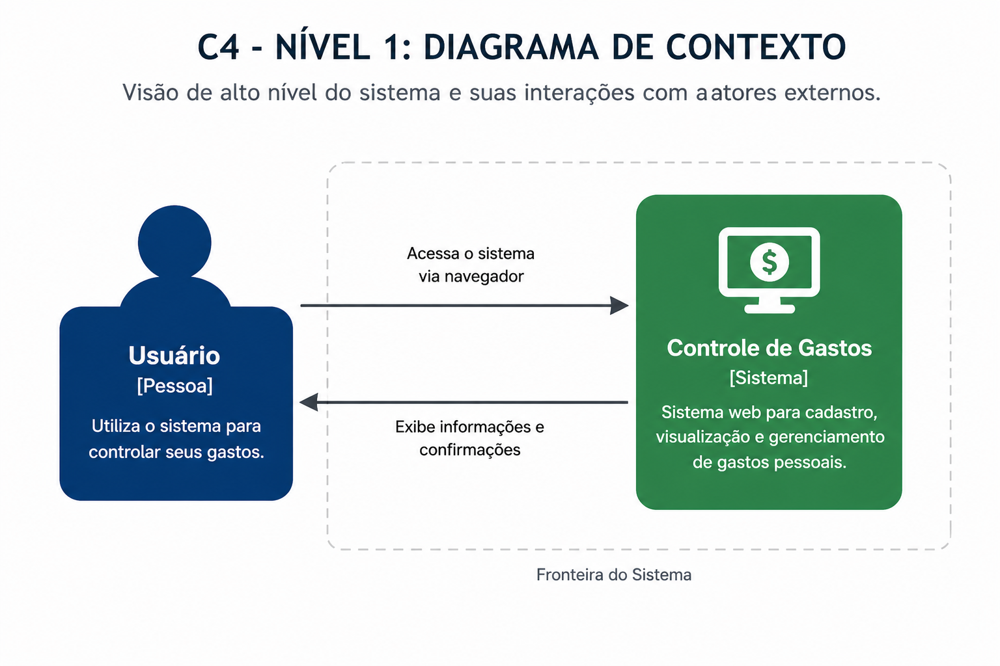
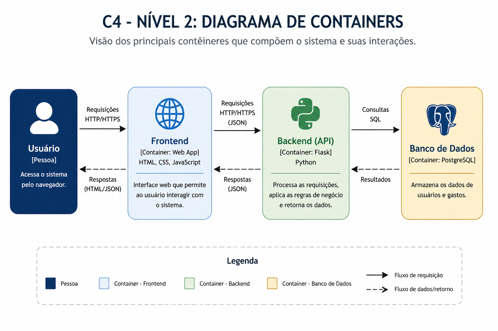

# Arquitetura do Sistema

## Modelo adotado

Foi utilizado o modelo C4 para representação da arquitetura do sistema, permitindo uma visão clara e organizada dos componentes e suas interações.

---

## Tecnologias utilizadas

- Frontend: HTML, CSS e JavaScript
- Backend: Python com Flask
- Banco de Dados: PostgreSQL

---

## Descrição da arquitetura

O sistema segue uma arquitetura cliente-servidor, composta por três principais camadas:

- Frontend: responsável pela interface com o usuário
- Backend: responsável pela lógica de negócio e processamento
- Banco de Dados: responsável pela persistência das informações

O usuário interage com o sistema através do navegador, enviando requisições ao backend, que processa os dados e se comunica com o banco de dados.

---

## Justificativa da arquitetura

A arquitetura escolhida é simples, modular e adequada para aplicações de pequeno porte.

O uso do Flask permite rápida implementação e fácil manutenção. O PostgreSQL garante confiabilidade e persistência dos dados. A separação entre frontend e backend facilita a organização e escalabilidade futura do sistema.

## Diagramas de Arquitetura

### Diagrama de Contexto (C4 - Nível 1)

### Diagrama de Containers (C4 - Nível 2)
